# MerryTaskmas
=======
<p align="center">
  
</p>

## Introduction

**MerryTaskmas** is an educational project developed for the final Hackathon of a Code Institute Bootcamp. In the spirit of the holiday season, we created MerryTaskmas, your ultimate holiday helper that tracks everything related to Christmas. This application allows you to manage your to-do lists, create Christmas wishlists for your loved ones, and features a countdown to Christmas, among other festive functionalities.

View the live site here: [MerryTaskmas]()

For Admin access with relevant sign-in information: [MarryTaskmas Admin]()

---

## Table of Contents

1. [Introduction](#introduction)
2. [Overview](#overview)
   - [Project Overview](#merry-taskmas-overview)
   - [Future Development Plans](#future-development-plans)
3. [UX - User Experience](#ux---user-experience)
   - [Design Inspiration](#design-inspiration)
   - [Colour Scheme](#colour-scheme)
   - [Font](#font)
4. [Project Planning](#project-planning)
   - [Strategy Plane](#strategy-plane)
   - [Site Goals](#site-goals)
   - [Agile Methodologies](#agile-methodologies---project-management)
   - [MoSCoW Prioritization](#moscow-prioritization)
5. [Merry Taskmas Features](#merry-taskmas-features)
6. [Scope Plane](#scope-plane)
   - [Essential Features](#essential-features-of-merry-taskmas)
   - [Should Have Features](#should-have-features)
   - [Could Have Features](#could-have-features)
7. [Structural Plane](#structural-plane)
   - [Application Structure](#application-structure)
8. [Skeleton & Surface Planes](#skeleton--surface-planes)
   - [Wireframes](#wireframes)
   - [Database Schema](#database-schema---entity-relationship-diagram)
   - [Entities and Relationships](#entities-and-relationships)
9. [Features](#features)
   - [User View - Registered/Unregistered](#user-view---registeredunregistered)
   - [CRUD Functionality](#crud-functionality)
   - [Feature Showcase](#feature-showcase)
10. [Technologies & Languages Used](#technologies--languages-used)
11. [Libraries & Frameworks](#libraries--frameworks)
12. [Tools & Programs](#tools--programs)
13. [Testing](#testing)
14. [Deployment](#deployment)
    - [Connecting to GitHub](#connecting-to-github)
    - [Django Project Setup](#django-project-setup)
    - [Cloudinary API](#cloudinary-api)
    - [Heroku Deployment](#heroku-deployment)
15. [Credits](#credits)
    - [Code](#code)
    - [Acknowledgements](#acknowledgements)


## Overview

# Merry Taskmas Overview

**Merry Taskmas** is a holiday organization app designed to help individuals manage the chaos of the Christmas season. It provides tools to streamline holiday planning, allowing users to:

- Keep track of the days until Christmas with a **dynamic countdown timer**.
- Create and manage a **to-do list** for all holiday-related tasks.
- Organize gifts with a **gift list**, including sections for family, friends and budget.
- Plan and schedule holiday events with a **calendar** (optional feature).
- Prepare for holiday gatherings with a **shopping list** and **meal planner** (optional features).

Merry Taskmas is fully accessible via modern web browsers and is responsive across all screen sizes. Its goal is to simplify holiday organization, reduce seasonal stress, and add a bit of festive cheer to everyday planning.

While other task management apps exist, Merry Taskmas is uniquely tailored to the Christmas holidays, offering specialized features like the Christmas countdown, gift tracker, and holiday-themed user interface.

## Future Development Plans:
- Enhanced gift list capabilities, such as tagging gifts with recipient preferences or marking gifts as “shipped” or “wrapped.”
- Interactive meal planner with built-in recipe suggestions for traditional holiday dishes.
- Ability to sync tasks, events, and shopping lists across devices.
- A sharing feature for collaborative planning with family and friends.

**Merry Taskmas** aims to bring joy, simplicity, and organization to every user’s Christmas season, fostering a stress-free and memorable holiday.


---

## UX - User Experience

### Design Inspiration

The design of **Merry Taskmas** was inspired by the previous project work of the development team. With this being the final bootcamp hackathon and the holiday season upon us, the team decided that a Christmas theme would be the perfect fit. 

The festive design aims to create a cheerful and engaging experience for users while maintaining functionality and simplicity to help them stay organized during the holidays.


### Colour Scheme

Christmas!

### Font

Using [Google Fonts](https://fonts.google.com/), I imported Alice and Raleway. Alice for headings and a bit of interest, the curls in the font felt a bit Christmassy. Raleway was used for clarity in the rest of the text.
  
# Project Planning  
 
## Strategy Plane

**Problem Statement**:  
How do we create a website that enables users to easily organize and manage tasks, events, and plans around the Christmas holidays?

**Purpose**:  
The purpose of **Merry Taskmas** is to:
- Simplify holiday organization and planning.
- Reduce seasonal stress by offering tools to track to-do lists, gifts, and events.
- Provide an intuitive and festive platform that fosters holiday cheer while keeping users on top of their tasks.
- Help users prepare for Christmas with features like a Christmas Countdown, To Do List, and Gift Tracker.

**Target Audience**:  
The primary target audience for **Merry Taskmas** includes:
- Individuals or families who want to organize their holiday season more efficiently.
- Busy professionals juggling work and holiday preparations.
- Anyone looking for a simple, accessible tool to track gifts, meals, and events during the Christmas season.
- People who enjoy a festive, cheerful theme while managing their tasks.

The app is designed for anyone who loves Christmas and could benefit from a user-friendly and engaging way to plan their holidays.


### Site Goals

- Have fun creating something in Django using CRUD functionality.

## Agile Methodologies - Project Management

**Merry Taskmas** was built using Agile methodology. Our team used the [GitHub Project Board](https://github.com/users/TaylaJBall/projects/3) to track our tasks, organize user stories, and ensure the project stayed within Scope. 

The board served as a central hub for documenting progress and maintaining focus throughout the development process.


### MoSCoW Prioritization

I chose to follow the MoSCoW Prioritization method for Merry Taskmas, identifying and labelling my:

- **Must Haves**: the 'required', critical components of the project. 
- **Should Haves**: the components that are valuable to the project but not absolutely 'vital' at the MVP stage. The 'Must Haves' must receive priority over the 'Should Haves'.
- **Could Haves**: these are the features that are a 'bonus' to the project, it would be nice to have them in this phase, but only if the most important issues have been completed first and time allows.
- **Won't Haves**: the features or components that either no longer fit the project's brief or are of very low priority for this release. 

### **Merry Taskmas Features**

| **ID** | **Title**                           | **User Stories**                                                                                  | **Priority**   |
|--------|-------------------------------------|--------------------------------------------------------------------------------------------------|----------------|
| **#1** | **User Login**                      | I want to log in to my account so that I can access my personal Christmas dashboard.             | **MUST HAVE**  |   
| **#2** | **Countdown to Christmas**          | I want to see a countdown to Christmas so that I can track how many days are left.               | **MUST HAVE**  |
| **#3** | **To-Do List for Preparations**     | I want to manage a to-do list so that I can organize tasks for Christmas preparations.           | **MUST HAVE**  |
| **#4** | **Wishlists for Gift Ideas**        | I want to create and manage wishlists for different people so that I can keep track of gift ideas. | **MUST HAVE**  |
| **#5** | **Festive UI**                      | I want to see a festive design on the dashboard so that I feel the Christmas spirit while using it. | **MUST HAVE**  |
| **#6** | **Registration**                    | I want to register for an account so that I can create my personalized dashboard.                | **MUST HAVE**  |
| **#7** | **Calendar for Parties/Events**     | I want to have a calendar to track Christmas parties and events so that I can stay organized.    | **SHOULD HAVE**|
| **#8** | **Meal Planner**                    | I want to plan meals for the holiday season so that I can stay organized and prepared for dinners. | **COULD HAVE** |
| **#9** | **Shopping List**                   | I want to manage a shopping list for Christmas so that I can keep track of the items I need to buy. | **COULD HAVE** |

## **Scope Plane**

The scope for this project focuses on delivering a **personalized Christmas planning dashboard** while ensuring the most essential features are implemented. While there are many possibilities for expanding the functionality, we narrowed it down to what was necessary for users to organize and enjoy their Christmas preparations effectively.

We initially considered incorporating advanced third-party APIs, such as calendar integrations or meal planning tools, but we found that simplicity was key for this first version. Features such as **user authentication**, a **countdown to Christmas**, and **task and gift management** were critical to achieving the project's goals.

This scope prioritizes delivering a functional and festive platform that enables users to plan, organize, and engage with their Christmas preparations.

---

### **Essential Features of Merry Taskmas**

- **User Authentication**
  - Registration, login, and logout functionality
  - Personalized dashboard for each user

- **Countdown to Christmas**
  - A real-time countdown feature displaying the days, hours, and minutes until Christmas
  - Festive visual representation for added excitement

- **Task Management**
  - A to-do list for organizing Christmas preparations
  - Add, edit, and delete tasks to keep track of progress

- **Giftlist Management**
  - Ability to create and manage giftlists for gift ideas
  - Separate giftlists for different people (e.g., family, friends)

- **Festive Design**
  - A visually appealing and festive user interface to create a joyful experience
  - Snowfall effects, Christmas-themed colors, and imagery

  ### **Should have Features

- **Event Management**
  - A calendar to track Christmas parties and events
  - Simplified event addition and management functionality

  ### **Could have Features

- **Meal Planning**
  - A section to plan meals for the holiday season
  - Ability to add dishes, edit menus, and organize meals for specific days

- **Shopping List**
  - A shopping list to manage items required for Christmas
  - Add, mark as purchased, and delete items as needed

---

### **Additional Considerations**
1. **User Experience**  
   - Ensuring the interface is intuitive and responsive for all devices.  
   - Keeping the design festive without compromising usability.

2. **Scalability**  
   - This first version focuses on core features but lays the groundwork for future enhancements like:  
     - Notifications for tasks and events  
     - Integration with external calendars (Google Calendar)  
     - Sharing wishlists with others.  

3. **User Control**  
   - Providing users with the ability to edit and delete their own tasks, wishlists, and events to maintain control over their data.

---

This scope ensures that **Merry Taskmas** delivers a clear, functional, and festive platform, providing essential tools for Christmas organization while leaving room for further growth in the future.

## **Structural Plane**

The structural plane focuses on the organization and architecture of the Merry Taskmas website. The goal is to create a functional, maintainable, and scalable site, adhering to Django’s **Model-View-Template (MVT)** framework. This structure ensures a clear separation of concerns and allows for future growth. We tried to adapt our previous projects to use in this project as there was very little time to complete it. 

---

### **Application Structure**

The Merry Taskmas project is divided into modular apps, each handling a distinct part of the functionality:

1. **Accounts**  
   - The **landing page** is the login page (`/accounts/login/`), ensuring that unauthenticated users are immediately prompted to sign in or sign up.  
   - Built using `django-allauth` to handle registration, login, and logout securely.  
   - Users are redirected to the dashboard (`/`) upon successful login.  

2. **Home**  
   - The **dashboard** for authenticated users, providing a central hub for accessing key features such as tasks, giftlists, and events.  
   - Redirects unauthenticated users back to the login page.

3. **Tasks**  
   - Allows users to manage a to-do list for Christmas preparations.  
   - Features include adding, editing, and deleting tasks.

4. **Giftlist**  
   - Enables users to create and manage wishlists for gift ideas.  
   - Supports multiple lists for different individuals (e.g., family, friends).

5. **Calendar**  
   - A calendar feature that helps users organize Christmas parties and events. (Should have feature)

6. **Core**  
   - Handles shared components like static files (CSS, JS), templates, and other common utilities.

# Skeleton & Surface Planes

### Wireframes

The wireframes for Merry Taskmas are fairly high fidelity and were created in [Figma](www.figma.com). We kept mostly to the general design. The circles in the footer represent each team member's picture and socials. 

**Mobile/Tablet view for:**  

- Sign In

<details open>
    <summary>Mobile/Tablet Sign In Page Wireframe</summary>  
    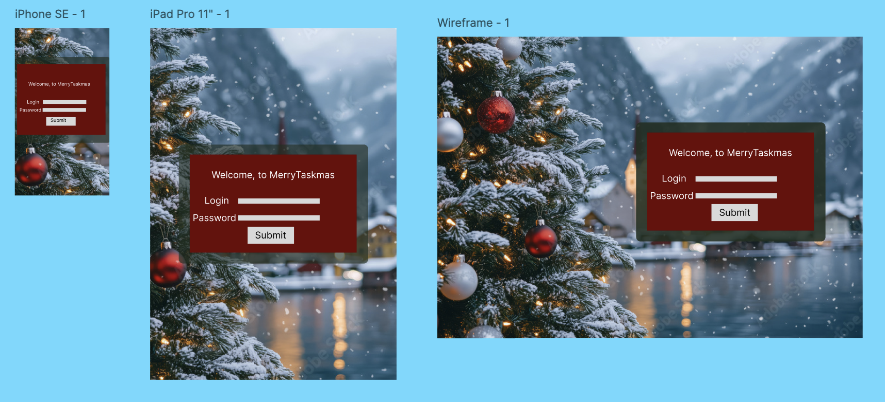  
</details>

- Home Page

<details open>
    <summary>Mobile/Tablet Home Page Wireframe</summary>  
    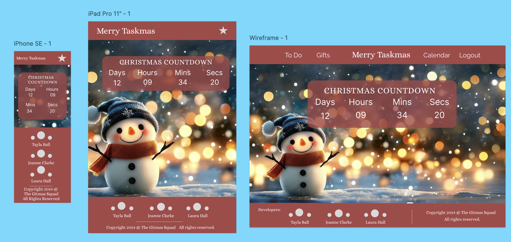  
</details>

### Database Schema - Entity Relationship Diagram

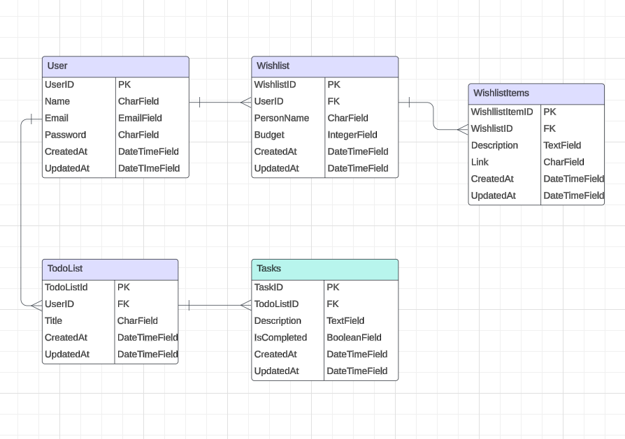  
*Database Schema (ERD) for Merry Taskmas*

The Entity Relationship Diagram (ERD) for the Merry Taskmas project visually represents the data structure and relationships between various entities in the system. This diagram reflects the key components of the website, such as user management, wishlists, to-do lists, and tasks, and how they interact with one another.

Note: We did change wishlist to giftlist as we preferred the terminology. A user is listing possible gifts to by for loved ones.

---

### **Entities and Relationships**

#### **1. User**
The **User** entity represents the core users of the Merry Taskmas platform. Each user can interact with multiple features such as creating wishlists, managing tasks, and organizing to-do lists.  

**Attributes**:  
- `UserID` (Primary Key): Unique identifier for each user.  
- `Name`: The user's name.  
- `Email`: Email address for user login.  
- `Password`: Encrypted password for authentication.  
- `CreatedAt`: Timestamp for account creation.  
- `UpdatedAt`: Timestamp for the last update to the user’s profile.  

**Relationships**:  
- A **User** can have multiple **Wishlists**.  
- A **User** can also create multiple **ToDoLists**.

---

#### **2. Wishlist**
The **Wishlist** entity allows users to create separate lists for different individuals (e.g., family members, friends) with a specific budget.  

**Attributes**:  
- `WishlistID` (Primary Key): Unique identifier for each wishlist.  
- `UserID` (Foreign Key): Links the wishlist to a specific user.  
- `PersonName`: Name of the person for whom the wishlist is created.  
- `Budget`: Total budget allocated for the wishlist.  
- `CreatedAt`: Timestamp for wishlist creation.  
- `UpdatedAt`: Timestamp for the last update to the wishlist.  

**Relationships**:  
- A **Wishlist** can have multiple **WishlistItems**.

---

#### **3. WishlistItems**
The **WishlistItems** entity contains individual gift ideas or items that belong to a wishlist.  

**Attributes**:  
- `WishlistItemID` (Primary Key): Unique identifier for each wishlist item.  
- `WishlistID` (Foreign Key): Links the item to a specific wishlist.  
- `Description`: Detailed description of the gift item.  
- `Link`: A URL or reference link for the gift (e.g., online store link).  
- `CreatedAt`: Timestamp for item creation.  
- `UpdatedAt`: Timestamp for the last update to the item.  

**Relationships**:  
- Each **WishlistItem** is linked to a specific **Wishlist**.  

---

#### **4. TodoList**
The **TodoList** entity allows users to manage lists of tasks needed for Christmas preparations.  

**Attributes**:  
- `TodoListID` (Primary Key): Unique identifier for each to-do list.  
- `UserID` (Foreign Key): Links the to-do list to a specific user.  
- `Title`: Title or name of the to-do list.  
- `CreatedAt`: Timestamp for to-do list creation.  
- `UpdatedAt`: Timestamp for the last update to the to-do list.  

**Relationships**:  
- A **TodoList** can have multiple **Tasks**.  

---

#### **5. Tasks**
The **Tasks** entity stores individual tasks that belong to a to-do list. These tasks can be marked as completed or pending.  

**Attributes**:  
- `TaskID` (Primary Key): Unique identifier for each task.  
- `TodoListID` (Foreign Key): Links the task to a specific to-do list.  
- `Description`: A detailed description of the task.  
- `IsCompleted`: Boolean field indicating if the task is completed (`True`) or not (`False`).  
- `CreatedAt`: Timestamp for task creation.  
- `UpdatedAt`: Timestamp for the last update to the task.  

**Relationships**:  
- Each **Task** is linked to a specific **TodoList**.  

---

### **Relationships Overview**

1. **User ↔ Wishlist**:  
   - A single user can create multiple wishlists.  
   - Each wishlist belongs to one user.

2. **Wishlist ↔ WishlistItems**:  
   - A single wishlist can contain multiple items (gifts).  
   - Each item belongs to one wishlist.

3. **User ↔ TodoList**:  
   - A single user can create multiple to-do lists.  
   - Each to-do list belongs to one user.

4. **TodoList ↔ Tasks**:  
   - A single to-do list can contain multiple tasks.  
   - Each task belongs to one to-do list.

---

# **Features**

## **User View - Registered/Unregistered**

The **sign-in page** is the landing page for all users. Only **registered, logged-in users** can access the main dashboard (home) and interact with features like tasks and gift lists. Unregistered users do not have access to the dashboard or the countdown.

| **Feature**              | **Unregistered User**                  | **Registered, Logged-In User**                    |
|---------------------------|---------------------------------------|--------------------------------------------------|
| **Landing Page**          | Visible - sign-in/register page       | Not applicable (redirected to dashboard)         |
| **Home Page (Dashboard)** | Not Visible                          | Visible - personalized dashboard with all features|
| **Countdown to Christmas**| Not Visible                          | Visible - real-time countdown to Christmas       |
| **Task List**             | Not Visible                          | Visible - create, manage, and delete tasks       |
| **Gift List**             | Not Visible                          | Visible - create and manage gift lists           |

---

## **CRUD Functionality**

Registered users have access to **Create, Read, Update, and Delete (CRUD)** functionality for tasks and gift lists. Each feature is designed to provide the necessary interaction options for organizing Christmas preparations.

| **Feature**         | **Create**                           | **Read**                               | **Update**                    | **Delete**                      |
|----------------------|---------------------------------------|---------------------------------------|--------------------------------|---------------------------------|
| **Tasks**           | Yes - add tasks to a to-do list       | Yes - view all tasks in the list       | Yes - update task descriptions | Yes - delete individual tasks   |
| **Gift Lists**      | Yes - create new gift lists           | Yes - view gift lists                  | Yes - update gift list names   | Yes - delete gift lists         |

---

# **Feature Showcase**

## **Header/Navigation & Footer**

The navigation and footer dynamically change depending on the user’s status. For mobile view, I customized the hamburger icon into a **gift box** while maintaining its traditional position for consistency. Attempts to center the navigation caused visual clutter and confusion during testing, so I kept it on the **right-hand side** for clarity.


<details open>
    <summary>Header & Navigation - Registered Users</summary>  
    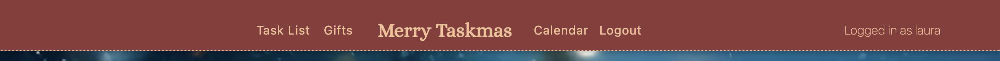  
</details>

<details open>
    <summary>Footer - Registered Users</summary>  
    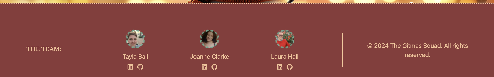  
</details>

---

## **Sign-In Page**

The **sign-in page** is the landing page for all users. It includes a simple and clean design with festive styling. Registered users are redirected to the **dashboard** after successful login.

<details open>
    <summary>Sign In Page</summary>  
      
</details>

---

## **Home Page (Dashboard)**

The **home page** serves as the main dashboard for registered users. The real-time **Countdown to Christmas** dynamically displays the time remaining until Christmas Day. This festive feature adds excitement and serves as a constant reminder of the upcoming holiday.

<details open>
    <summary>Home Page - Dashboard - Countdown</summary>  
    <div style="display: flex; gap: 10px; justify-content: center; align-items: center;">
        
        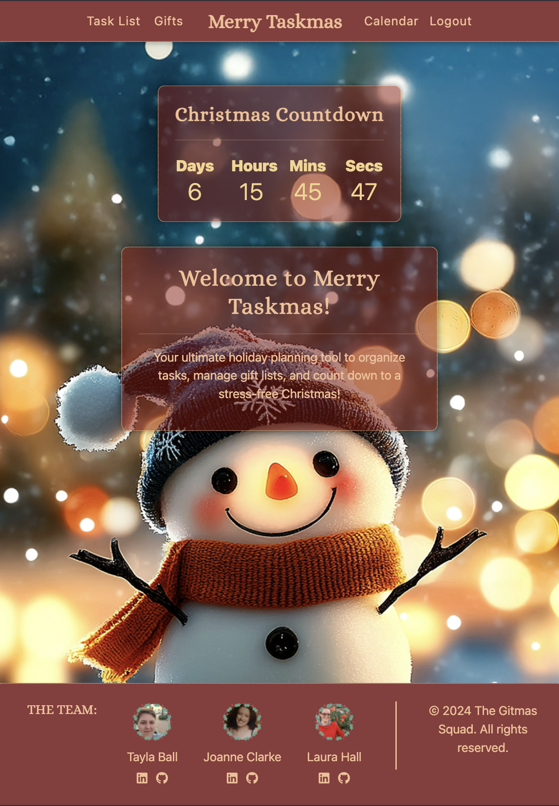
        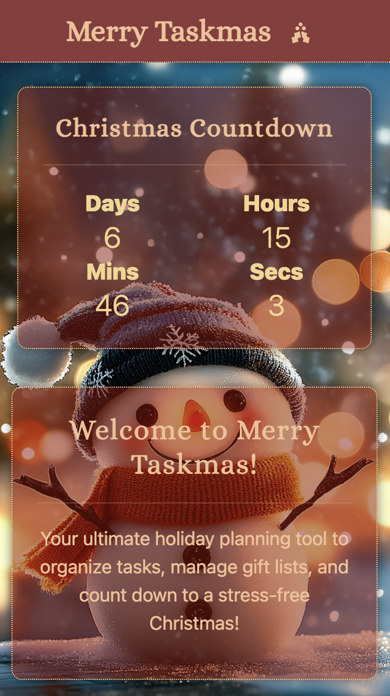
    </div>
</details>

---

## **Task List**

The **Task List** allows registered users to manage their Christmas preparation tasks. Users can add, edit, mark tasks as complete, and delete tasks as needed.

<details open>
    <summary>Task List</summary>  
      
</details>

---

## **Gift List**

The **Gift List** enables users to organize gift ideas for friends and family. Users can create multiple gift lists, add recipients, set budgets, and manage gift ideas.

<details open>
    <summary>Gift List Page</summary>  
    <div style="display: flex; gap: 10px; justify-content: center; align-items: center;">
        
        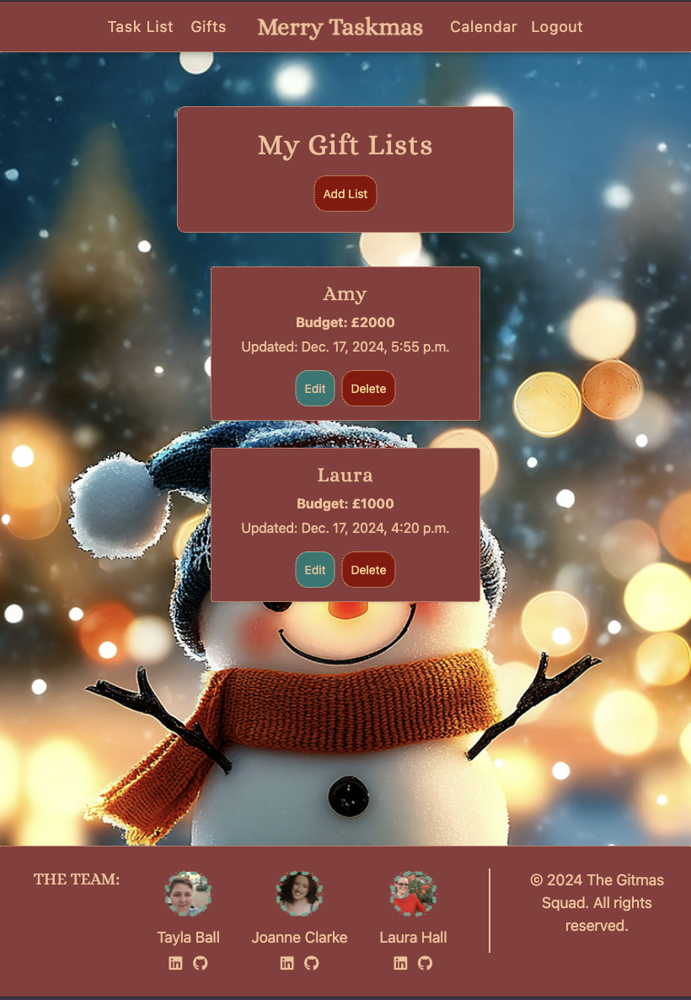
        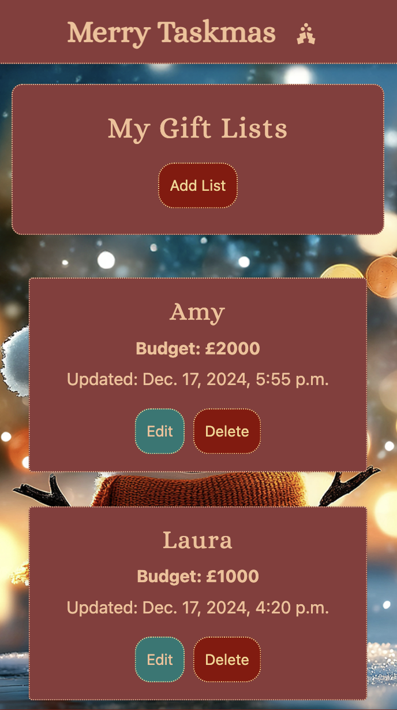
    </div>
</details>

---

## **Log Out**

The logout confirmation page ensures users do not accidentally log out. 

<details open>
    <summary>Log Out Page</summary>  
    <div style="display: flex; gap: 10px; justify-content: center; align-items: center;">
        
        
        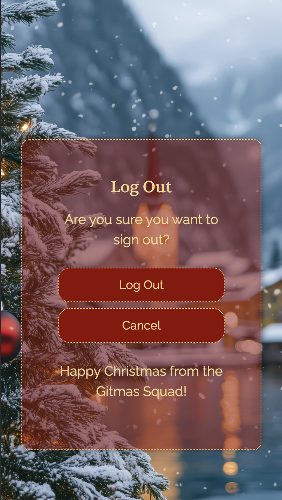
    </div>
</details>

<br>
<hr>

## **Register Page**

Users can sign up for an account using **Django AllAuth**, with the option to log in using their email. I considered integrating Google login but decided to prioritize core functionality for this version of the project.

<details open>
    <summary>Sign Up Page</summary>  
    <div style="display: flex; gap: 10px; justify-content: center; align-items: center;">
        
        
        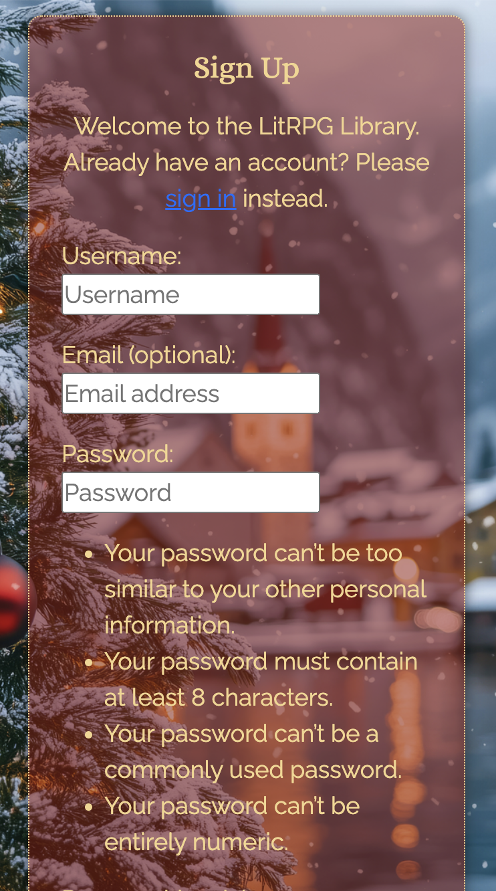
    </div>
</details>

<br>
<hr>


## **Admin Panel**

The Django **Admin Panel** gives site administrators full control over user-generated data. Administrators can manage tasks, gift lists, and other features submitted by users. Admin approval is required to maintain site integrity and prevent misuse.

To access the Admin Panel, an admin user adds `/admin/` to the URL. A username and password are required to log in.

<details open>
    <summary>Admin Panel</summary>  
      
</details>

---

## **Future Features**

Future enhancements for **Merry Taskmas** will focus on expanding functionality and improving the user experience. Planned features include:

- **Calendar Integration**: Integrating a calendar feature to allow users to add and track Christmas events, parties, and important dates seamlessly.

- **Shopping List**: A dedicated shopping list functionality where users can manage items needed for Christmas, mark them as purchased, and organize them efficiently.

- **Meal Planning**: Adding a meal planner feature to help users organize meals for Christmas dinners and other festive gatherings, including options to add recipes and ingredients.

- **Gift List Sharing**: Enabling children, friends, or family members to send their wishlists directly to users. This feature would allow gift lists to be shared and imported into a user’s dashboard for easier gift planning.

- **Advanced Notifications**: Implementing reminders and notifications for tasks, events, and deadlines, helping users stay on top of their Christmas preparations.

- **User Dashboard Enhancements**: A more interactive user dashboard where users can track their progress on tasks, view gift list budgets, and see an overview of their planned events.

- **Data Export Options**: Allowing users to export their task lists, gift lists, and meal plans to formats such as PDF or Excel for offline access.

- **Improved Countdown Features**: Adding more interactive elements to the countdown, such as festive animations, daily reminders, and personalized messages as Christmas approaches.

These future improvements aim to make **Merry Taskmas** an even more powerful tool for organizing and celebrating the holiday season.


# Technologies & Languages Used

- HTML
- CSS
- JavaScript
- Python
- [Git](https://git-scm.com/) used for version control.
- [Github](https://www.github.com) used for online storage of codebase and Projects tool.
- [GitPod](https://codeinstitute-ide.net/workspaces) as the IDE Code Institute recommeneds we use.
- [Figma](https://www.figma.com) for project design planning and wireframe creation.
- [Adobe Color](https://color.adobe.com) for colour theme creation and accessibility checkers.
- [Django](https://www.djangoproject.com/) was used as the Python framework for the site.
- [Cloudinary](https://cloudinary.com/) was used for cloud media storage.
- [PostgreSQL from Code Institute](https://dbs.ci-dbs.net/) create and host the database.
- [Heroku](https://www.heroku.com) was used to host the Merry Taskmas application.
- [WAVE](https://wave.webaim.org/) to evaluate the accessibility of the site.
- [Canva](https://canva.com/) for image creation and editing.
- Adobe Photoshop for editing background images.

## Libraries & Frameworks

- cloudinary==1.41.0
- dj-database-url==0.5.0
- dj3-cloudinary-storage==0.0.6
- Django==4.2.17
- django-allauth==65.3.0
- django-crispy-forms==2.3
- gunicorn==20.1.0
- psycopg==3.2.3
- sqlparse==0.5.3
- urllib3==1.26.20
- whitenoise==5.3.0
  
Further information is available in the [requirements.txt file](requirements.txt)

## Tools & Programs

- [Perplexity AI](https://www.perplexity.ai/) for breaking down Python concepts and Django documentation into more understandable chunks, helping problem solve coding issues and generating most of the website text.
- [Chat GPT](https://chatgpt.com/) As above.
- [Favicon](https://favicon.io/) for creating the favicon.
- [Lucid Chart](https://www.lucidchart.com/) for creating the ERD.
- [Coolors](https://coolors.co) for the colour palatte.

# Testing

- For all testing, please refer to the [TESTING.md](TESTING.md) file.


# Deployment
  
## Connecting to GitHub  

To begin this project from scratch, you must first create a new GitHub repository using the [Code Institute's Template](https://github.com/Code-Institute-Org/ci-full-template). This template provides the relevant tools to get you started. To use this template:

1. Log in to [GitHub](https://github.com/) or create a new account.
2. Navigate to the above CI Full Template.
3. Click '**Use this template**' -> '**Create a new repository**'.
4. Choose a new repository name and click '**Create repository from template**'.
5. In your new repository space, click the green 'open' button to generate a new workspace.

## Django Project Setup

1. Install Django and supporting libraries: 
   
- ``` pip3 install Django~=4.2.1 ```
- ``` pip3 install gunicorn~=20.1```
- ``` pip3 install dj-database-url~=0.5 psycopg```
- ``` pip3 install dj3-cloudinary-storage~=0.0.6```
- ```pip3 install urllib3~=1.26.15``` 
- ``` pip3 install django-summernote~=0.8.20.0```
  
2. As you are installing any relevant dependencies or libraries, such as the ones listed above, it is important to create a **requirements.txt** file and add all installed libraries to it with the ```pip3 freeze --local > requirements.txt``` command in the terminal.  
3. Create a new Django project in the terminal ```django-admin startproject config.```
4. Create a new app eg. ```python3 mangage.py startapp review```
5. Add this to list of **INSTALLED_APPS** in **settings.py** - 'review',
6. Create a superuser for the project to allow Admin access and enter credentials: ```python3 manage.py createsuperuser```
7. Migrate the changes with commands: ```python3 manage.py migrate```
8. An **env.py** file must be created to store all protected data such as the **DATABASE_URL** and **SECRET_KEY**. These may be called upon in your project's **settings.py** file along with your Database configurations. The **env.py** file must be added to your **gitignore** file so that your important, protected information is not pushed to public viewing on GitHub. For adding to **env.py**:

- ```import os```
- ```os.environ["DATABASE_URL"]="<PostgreSQL_URL_from_CI>"``` [CI Database Maker](https://dbs.ci-dbs.net/)
- ```os.environ["SECRET_KEY"]="insertYourOwnKeyHere"```
  
For adding to **settings.py**:

- ```import os```
- ```import dj_database_url```
- ```if os.path.exists("env.py"):```
- ```import env```
- ```SECRET_KEY = os.environ.get('SECRET_KEY')``` (actual key hidden within env.py)  

9. Replace **DATABASES** with:

```
DATABASES = {
    'default': dj_database_url.parse(os.environ.get("DATABASE_URL"))
  }
```

10. Set up the templates directory in **settings.py**:
- Under ``BASE_DIR`` enter ``TEMPLATES_DIR = os.path.join(BASE_DIR, ‘templates’)``
- Update ``TEMPLATES = 'DIRS': [TEMPLATES_DIR]`` with:

```
os.path.join(BASE_DIR, 'templates'),
os.path.join(BASE_DIR, 'templates', 'allauth')
```

- Create the media, static and templates directories in top level of project file in IDE workspace.

11. A **Procfile** must be created within the project repo for Heroku deployment with the following placed within it: ```web: gunicorn config.wsgi```
12. Make the necessary migrations again.

## Cloudinary API 

Cloudinary provides a cloud hosting solution for media storage. All users uploaded images in the Merry Taskmas project are hosted here.

Set up a new account at [Cloudinary](https://cloudinary.com/) and add your Cloudinary API environment variable to your **env.py** and Heroku Config Vars.
In your project workspace: 

- Add Cloudinary libraries to INSTALLED_APPS in settings.py 
- In the order: 
```
 'django.contrib.staticfiles',
  'cloudinary_storage',
  'cloudinary',

```
- Add to **env.py** and link up with **settings.py**: ```os.environ["CLOUDINARY_URL"]="cloudinary://...."``` 
- Set Cloudinary as storage for media and static files in settings.py:
- ```STATIC_URL = '/static/'```
```
  STATICFILES_STORAGE = 'cloudinary_storage.storage.StaticHashedCloudinaryStorage'  
  STATICFILES_DIRS = [os.path.join(BASE_DIR, 'static'), ]  
  STATIC_ROOT = os.path.join(BASE_DIR, 'staticfiles')‌  
  MEDIA_URL = '/media/'  
  DEFAULT_FILE_STORAGE = 'cloudinary_storage.storage.MediaCloudinaryStorage'
```

## CI DB Maker
1. Open the CI DB maker (https://dbs.ci-dbs.net/)
2. Input your email address and click ‘Submit’
3. Read the important notes- there’s a limit to the amount of concurrent databases you can create
4. Check your email for the new PostgreSQL database url. Copy it and follow the steps above.


## Heroku deployment

To start the deployment process, please follow the below steps:

1. Log in to [Heroku](https://id.heroku.com/login) or create an account if you are a new user.
2. Once logged in, in the Heroku Dashboard, navigate to the '**New**' button in the top, right corner, and select '**Create new app**'.
3. Enter an app name and choose your region. Click '**Create App**'. 
4. In the Deploy tab, click on the '**Settings**', reach the '**Config Vars**' section and click on '**Reveal Config Vars**'. Here you will enter KEY:VALUE pairs for the app to run successfully. The KEY:VALUE pairs that you will need are your: 
   
   - **CLOUDINARY_URL**: **cloudinary://....** 
   - **DATABASE_URL**:**postgres://...** 
   - **DISABLE_COLLECTSTATIC** of value '1' (N.B Remove this Config Var before deployment),
   -  **SECRET_KEY** and value  
  
5. Add the Heroku host name into **ALLOWED_HOSTS** in your projects **settings.py file** -> ```['herokuappname', ‘localhost’, ‘8000 port url’].```
6. Once you are sure that you have set up the required files including your requirements.txt and Procfile, you have ensured that **DEBUG=False**, save your project, add the files, commit for initial deployment and push the data to GitHub.
7. Go to the '**Deploy**' tab and choose GitHub as the Deployment method.
8. Search for the repository name, select the branch that you would like to build from, and connect it via the '**Connect**' button.
9.  Choose from '**Automatic**' or '**Manual**' deployment options, I chose the 'Manual' deployment method. Click '**Deploy Branch**'.
10. Once the waiting period for the app to build has finished, click the '**View**' link to bring you to your newly deployed site. If you receive any errors, Heroku will display a reason in the app build log for you to investigate. **DISABLE_COLLECTSTATIC**  may be removed from the Config Vars once you have saved and pushed an image within your project.
11. Double check that your dynos are on and configured correctly in **Overview**. If you need to change the type of dynos being used or turn them on go to **Resources**.

# Credits

## Code

- [Code Institute's](learn.codeinstitute.net) Learning Content and supporting documents, especially the  'I Think Therefore I Blog' section and Django Deployment Guidelines PDF.
- [Perplexity AI](https://www.perplexity.ai/) for helping problem solve coding issues.
- [Chat GPT](https://chatgpt.com/) As above.
- [Bootstrap 5](https://getbootstrap.com/docs/4.1/getting-started/introduction/) for many of the project's features.
- [Geeks For Geeks](https://www.geeksforgeeks.org/event-countdown-timer-using-django/) for guidance on the Christmas countdown.


## Acknowledgements


