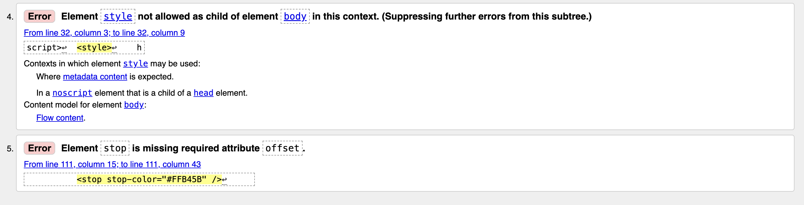
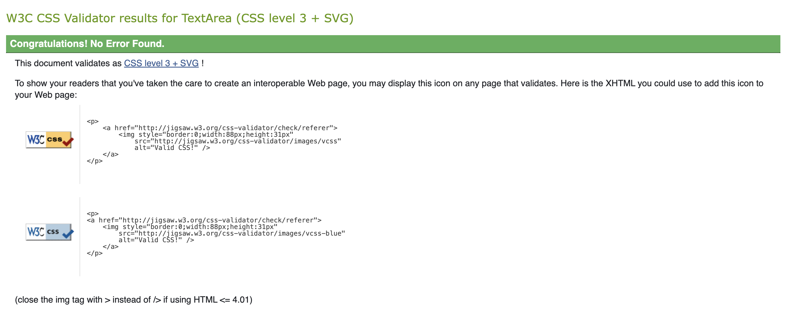
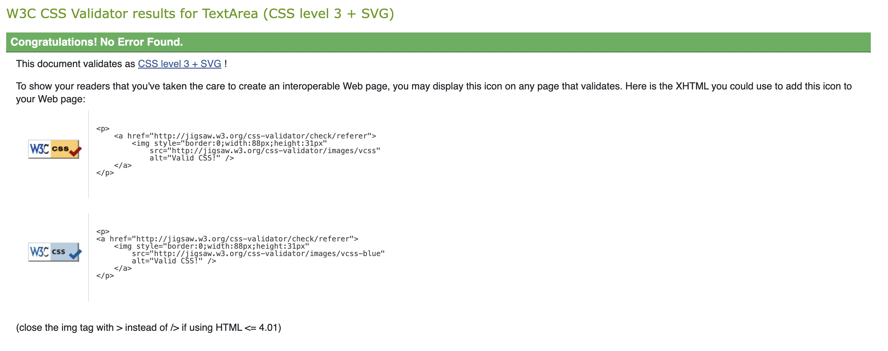
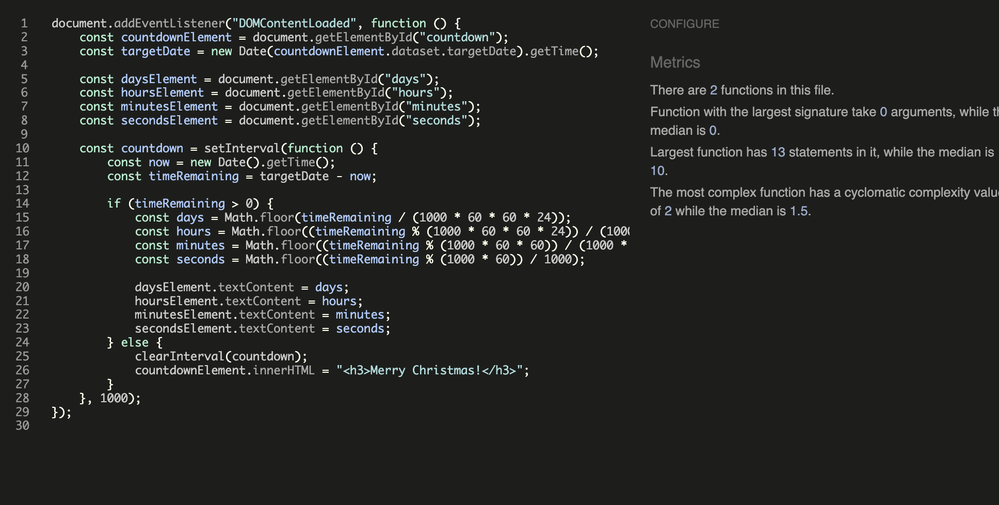
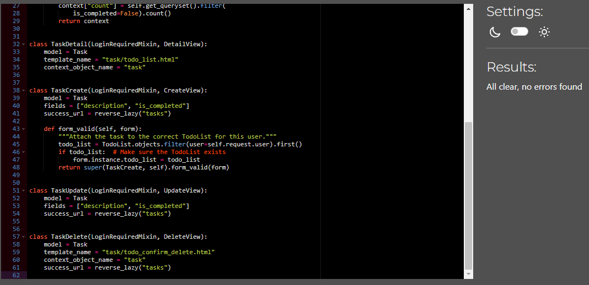
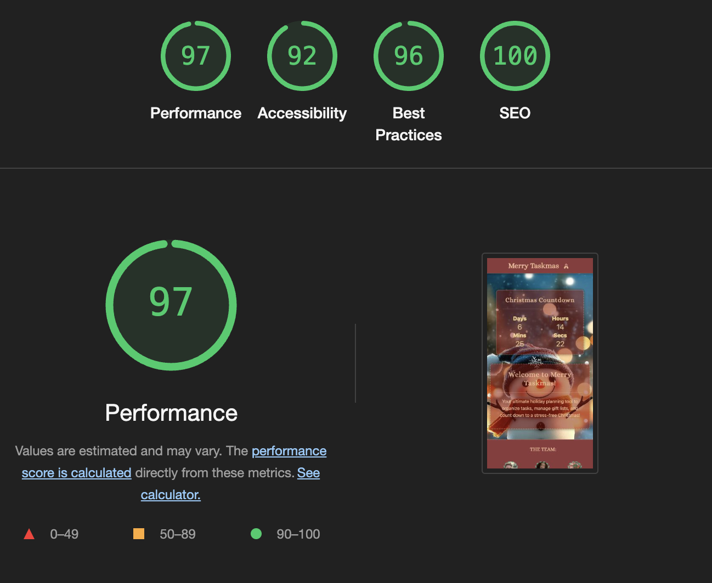
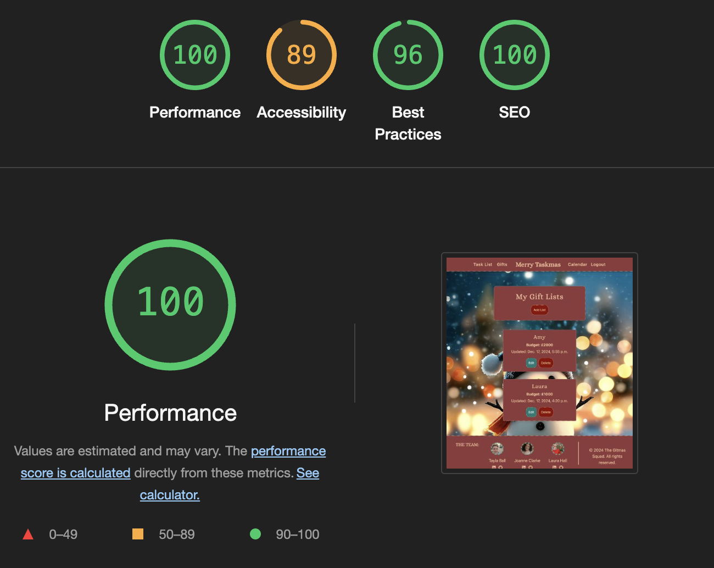
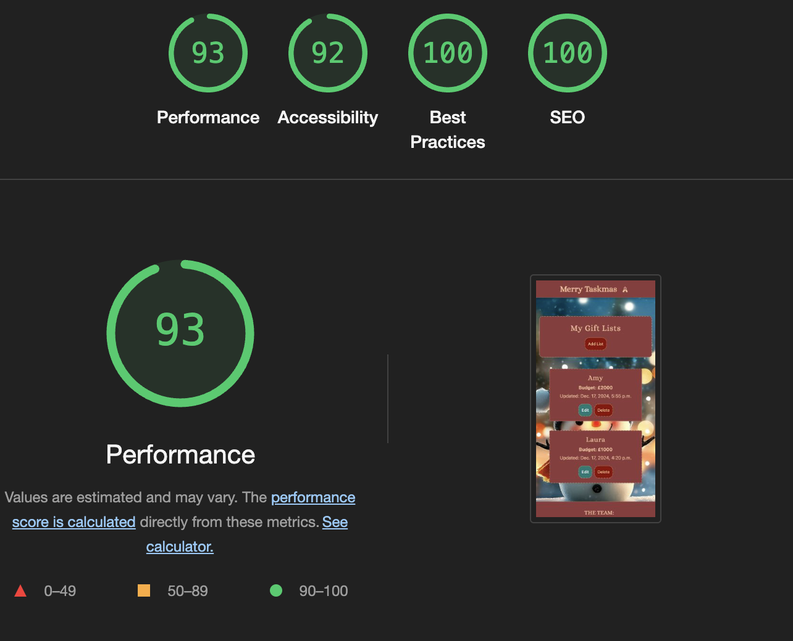
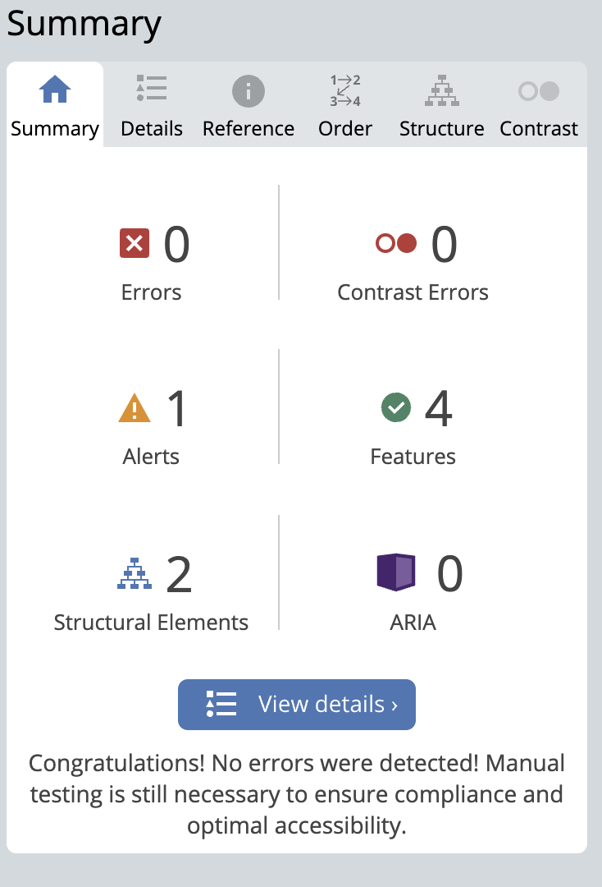

# Testing

This is the TESTING file for the [MerryTaskmas](https://merrytaskmas-e050025a1784.herokuapp.com/) website.

Return back to the [README.md](README.md) file.

## Testing Contents

- [Testing](#testing)
  - [Validation](#validation)
    - [HTML Validation](#html-validation)
    - [CSS Validation](#css-validation)
    - [JavaScript Validation](#javascript-validation)
    - [Python Validation](#python-validation)
    - [Lighthouse Scores](#lighthouse-scores)
    - [Wave Accessibility Evaluation](#wave-accessibility-evaluation)
  - [Manual Testing](#manual-testing)
    - [User Input/Form Validation](#user-inputform-validation)
    - [Browser Compatibility](#browser-compatibility)
    - [Testing User Stories](#testing-user-stories)
    - [Dev Tools/Real World Device Testing](#dev-toolsreal-world-device-testing)
  - [Bugs](#bugs)
    - [Known Bugs](#known-bugs)

---

## Validation

### HTML Validation

HTML pages were validated using the [W3C HTML Validator](https://validator.w3.org/). Minor errors related to **Django forms** or third-party tools were found but considered non-critical.

| Page                   | Errors | Warnings |
|------------------------|--------|----------|
| Home - Countdown                  | 0      | 0        |
| Login                  | 0      | 0        |
| Logout                 | 0      | 0        |
| Register               | 2     | 0        |
| Gift List Page         | 0      | 0        |
| Add Gift List          | 0      | 0        |
| Edit Gift List         | 0      | 0        |
| Delete Gift List       | 0      | 0        |
| View Gift List       | 0      | 0        |
| Add Item               | 1      | 0        |
| Edit Item              | 1     | 0        |
| Task List              | 1     | 0        |

  
Example Screenshot - Register Page

  

---

### CSS Validation

The CSS file was validated using the [W3C CSS Validator](https://jigsaw.w3.org/css-validator/), and no errors were found.

---

### JavaScript Validation

The JavaScript files were validated using [JSHint](https://jshint.com/). All files passed without errors.

| File                 | Errors | Warnings |
|----------------------|--------|----------|
| `countdown.js`       | 0      | 0        |

  
Example Screenshot - countdown.js

  

---

### Python Validation

Python files were validated using [CI Python Linter](https://pep8ci.herokuapp.com/) for PEP8 compliance. There were no errors.

| Feature | admin.py | forms.py | models.py | urls.py | views.py |
|---------|----------|----------|-----------|---------|----------|
| home | [no errors](/documentation/testing/Admin.py_home.png) | N/A | [no errors](/documentation/testing/Models.py_home.png) | [no errors](/documentation/testing/Urls.py_home.png) | [no errors](/documentation/testing/Views.py_home.png) |
| task | [no errors](/documentation/testing/Admin.py_task.png) | [no errors](/documentation/testing/Forms.py_task.png) | [no errors](/documentation/testing/Models.py_task.png) | [no errors](/documentation/testing/Urls.py_task.png) | [no errors](/documentation/testing/Views.py_task.png) |
| giftlist | [no errors](/documentation/testing/Admin.py_giftlist.png) | [no errors](/documentation/testing/Forms.py_giftlist.png) | [no errors](/documentation/testing/Models.py_giftlist.png) | [no errors](/documentation/testing/Urls.py_giftlist.png) | [no errors](/documentation/testing/Views.py_giftlist.png) |
| merrytaskmas| settings.py: [no errors](/documentation/testing/Settings.py_merrytaskmas.png) | N/A | N/A | [no errors](/documentation/testing/Urls.py_merrytaskmas.png) | N/A |

  
Example Screenshot - views.py

  

---

### Lighthouse Scores

Testing was conducted using **Google Lighthouse** for both **Desktop** and **Mobile** views.

**Desktop Results - Countdown Page**:

**Mobile Results Countdown Page**:

 

**Desktop Results - Giftlist Page**:

**Mobile Results Giftlist Page**:

---

### Wave Accessibility Evaluation

[WAVE Web Accessibility Evaluation Tool](https://wave.webaim.org/) was used to test accessibility. No errors were found and the one warning relates to out of order headings. However, only the login and signin pages are accessible to test with Wave as all other pages required a logged in user.

---

## Manual Testing

### User Input/Form Validation

Forms and user input were tested across the project to ensure proper behavior.

| Feature                        | User Input       | Expected Behavior                          | Result |
|--------------------------------|------------------|-------------------------------------------|--------|
| **Add Gift List**              | Name, Budget     | Person's gift List is added and displayed           | Pass   |
| **Edit Gift List**             | Update fields    | Changes are saved                          | Pass   |
| **Delete Gift List**           | Confirmation     | Person's Gift List is removed                       | Pass   |
| **Gift View**                   | Description, Link| Display's persons gift items                | Pass   |
| **Edit Gift Item**                  | Update fields    | Item changes are saved                     | Pass   |
| **Delete Gift Item**                | Confirmation     | Item is removed from Gift List             | Pass   |
| **Task List**                  | Task Input       | View task and add, edit or delete         | Pass   |
| **Task Form**                  | Task Input       | Add a task         | Pass   |
| **Task Confirm Delete**                  | Task Input       | Task confirm deletion        | Pass   |
| **Sign In/Out**                | Email, Password  | User signs in or out successfully          | Pass   |

---

### Browser Compatibility

Testing was conducted across modern browsers:

| Browser         | Version              | Result       |
|-----------------|----------------------|--------------|
| Chrome          | 131.0.x              | Pass         |
| Firefox         | 125.0.x              | Pass         |
| Safari          | 18.1.x               | Pass         |
| Edge            | 131.0.x              | Pass         |

---

### Testing User Stories

| User Story                               | Expected Outcome                          | Tested  | Result |
|-----------------------------------------|------------------------------------------|---------|--------|
| View countdown timer                    | See real-time countdown on Home page     | Yes     | Pass   |
| Add/edit/delete gift lists              | Manage gift lists for individuals        | Yes     | Pass   |
| Add/edit/delete items in gift lists     | Manage items with descriptions/links     | Yes     | Pass   |
| Sign up and log in                      | Register and log in with account         | Yes     | Pass   |
| View to-do list                         | Manage tasks for holiday planning        | Yes     | Pass   |
| Logout confirmation                     | Confirm logout with cancel option        | Yes     | Pass   |
| Event Calendar                     | A 'could do', not completed in this iteration       | No    | N/A   |
| Shopping List                    | A 'could do', not completed in this iteration          | No     | N/A  |
| Meal Planner                    | A 'could do', not completed in this iteration         | No    | N/A  |

---

### Dev Tools/Real World Device Testing

The site was tested on various devices:

| Device                  | Resolution | Result       |
|-------------------------|------------|--------------|
| iPhone 15          | 2556 x 1179    | Pass         |
| Galaxy Z Fold          | 2316 x 904 and 2176 x 1812 | Pass         |
| Samsung S 10         | 3040 x 1440 | Pass         |
| iPad Air  2023              | 820x1180   | Pass         |
| MacBook Air 2024           | 1440x900   | Pass         |
| Lenovo IdeaPad 15"       | 1920x1080  | Pass         |
| Desktop - MSI Monitor 27" curved   | 1920x1080  | Pass         |

---

## Bugs
There were several bugs that were a result of us learning how to collaborate using Django and still being fairly new to Django in the first place. Here are a sample of the bugs we encountered. 

| Bug Description                             | Status   | Fix/Action Taken                          |
|--------------------------------------------|----------|------------------------------------------|
| CSS styles not applying to buttons          | Solved - ChatGBT/Us  | Adjusted specificity for custom classes   |
| Task list item links overflowing            | Solved  - ChatGBT/Us  | Added `word-wrap: break-word` to styles   |
| Logout confirmation button alignment issue  | Solved - ChatGBT/Us   | Used Flexbox for consistent alignment     |
| Subbranches needed packages installed on main  | Solved  - Amy  | Subbranches needed to run pip3 install -r requirements.txt     |
| Unable to migrate or merge | Solved - Coding Coach   | Added a new DB because subbranches kept pulling in the old error and we were told that was the simplest fix    |

---

### Known Bugs

- Double messages when you sign in again. "You have signed out as.." and "You have signed in as.."
- "Updated on..." does not change in gift list pages as in the models created_at and updated_at are not set to auto_now. Since we noticed this fairly late on the last day we didn't want to change anything in the models and risk breaking it. 
---

## Conclusion

The **MerryTaskmas** website has been thoroughly tested for functionality, responsiveness, and accessibility. All major features work as intended, and minor bugs have been addressed or talked about here.

For any other issues, please let us know!

---
