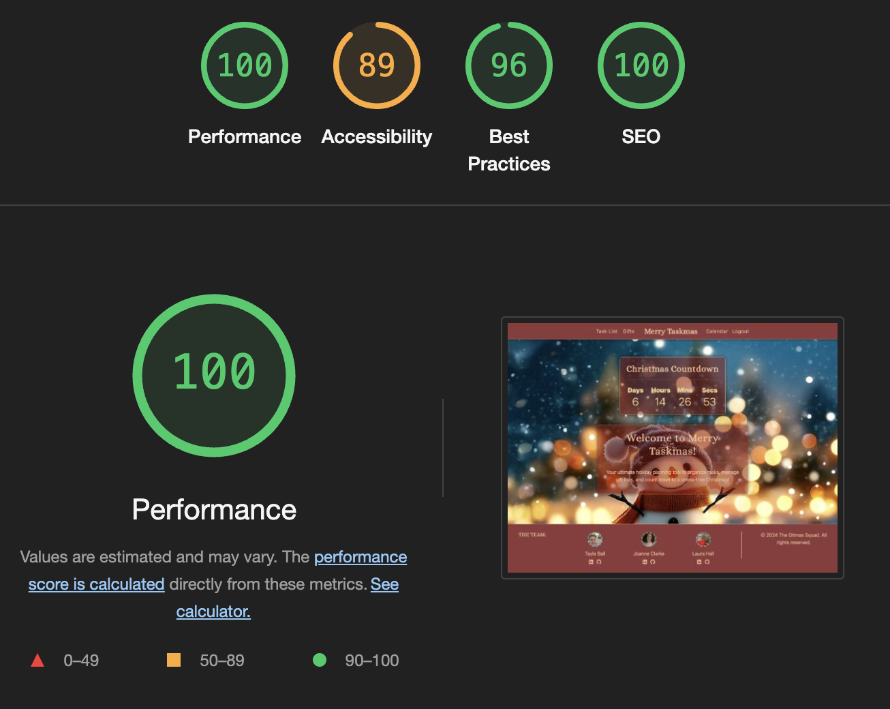

# Testing

This is the TESTING file for the [MerryTaskmas](https://merrytaskmas-e050025a1784.herokuapp.com/) website.

Return back to the [README.md](README.md) file.

## Testing Contents

- [Testing](#testing)
  - [Validation](#validation)
    - [HTML Validation](#html-validation)
    - [CSS Validation](#css-validation)
    - [JavaScript Validation](#javascript-validation)
    - [Python Validation](#python-validation)
    - [Lighthouse Scores](#lighthouse-scores)
    - [Wave Accessibility Evaluation](#wave-accessibility-evaluation)
  - [Manual Testing](#manual-testing)
    - [User Input/Form Validation](#user-inputform-validation)
    - [Browser Compatibility](#browser-compatibility)
    - [Testing User Stories](#testing-user-stories)
    - [Dev Tools/Real World Device Testing](#dev-toolsreal-world-device-testing)
  - [Bugs](#bugs)
    - [Known Bugs](#known-bugs)

---

## Validation

### HTML Validation

HTML pages were validated using the [W3C HTML Validator](https://validator.w3.org/). Minor errors related to **Django forms** or third-party tools were found but considered non-critical.

| Page                   | Errors | Warnings |
|------------------------|--------|----------|
| Home - Countdown                  | 0      | 0        |
| Login                  | 0      | 0        |
| Logout                 | 0      | 0        |
| Register               | 2     | 0        |
| Gift List Page         | 0      | 0        |
| Add Gift List          | 0      | 0        |
| Edit Gift List         | 0      | 0        |
| Delete Gift List       | 0      | 0        |
| View Gift List       | 0      | 0        |
| Add Item               | 0      | 0        |
| Edit Item              | 0      | 0        |
| Task List              | 0      | 0        |

  
Example Screenshot - Register Page

  

---

### CSS Validation

The CSS file was validated using the [W3C CSS Validator](https://jigsaw.w3.org/css-validator/), and no errors were found.

---

### JavaScript Validation

The JavaScript files were validated using [JSHint](https://jshint.com/). All files passed without errors.

| File                 | Errors | Warnings |
|----------------------|--------|----------|
| `countdown.js`       | 0      | 0        |

  
Example Screenshot - countdown.js

  

---

### Python Validation

Python files were validated using [CI Python Linter](https://pep8ci.herokuapp.com/) for PEP8 compliance. There were no errors.

| Feature | admin.py | forms.py | models.py | urls.py | views.py |
|---------|----------|----------|-----------|---------|----------|
| home | [no errors](documentation/testing/py/review_admin.png) | [no errors](documentation/testing/py/review_forms.png) | [no errors](documentation/testing/py/review_models.png) | [no errors](documentation/testing/py/review_urls.png) | [no errors](documentation/testing/py/review_views.png) |
| task | [no errors](documentation/testing/py/tbr_admin.png) | N/A | [no errors](documentation/testing/py/tbr_models.png) | [no errors](documentation/testing/py/tbr_urls.png) | [no errors](documentation/testing/py/tbr_views.png) |
| giftlist | settings.py: [no errors](documentation/testing/py/config_settings.png) | N/A | N/A | [no errors](documentation/testing/py/config_urls.png) | N/A |
| merrytaskmas| settings.py: [no errors](documentation/testing/py/config_settings.png) | N/A | N/A | [no errors](documentation/testing/py/config_urls.png) | N/A |

  
Example Screenshot - views.py

  

---

### Lighthouse Scores

Testing was conducted using **Google Lighthouse** for both **Desktop** and **Mobile** views.

**Desktop Results - Countdown Page**:

**Mobile Results Countdown Page**:

 

**Desktop Results - Giftlist Page**:

**Mobile Results Giftlist Page**:

---

### Wave Accessibility Evaluation

[WAVE Web Accessibility Evaluation Tool](https://wave.webaim.org/) was used to test accessibility. No errors were found and the one warning relates to out of order headings.

---

## Manual Testing

### User Input/Form Validation

Forms and user input were tested across the project to ensure proper behavior.

| Feature                        | User Input       | Expected Behavior                          | Result |
|--------------------------------|------------------|-------------------------------------------|--------|
| **Add Gift List**              | Name, Budget     | Gift List is added and displayed           | Pass   |
| **Edit Gift List**             | Update fields    | Changes are saved                          | Pass   |
| **Delete Gift List**           | Confirmation     | Gift List is removed                       | Pass   |
| **Add Item**                   | Description, Link| Item is added to Gift List                 | Pass   |
| **Edit Item**                  | Update fields    | Item changes are saved                     | Pass   |
| **Delete Item**                | Confirmation     | Item is removed from Gift List             | Pass   |
| **Task List**                  | Task Input       | Task is added, edited, or deleted          | Pass   |
| **Sign In/Out**                | Email, Password  | User signs in or out successfully          | Pass   |

---

### Browser Compatibility

Testing was conducted across modern browsers:

| Browser         | Version              | Result       |
|-----------------|----------------------|--------------|
| Chrome          | 131.0.x              | Pass         |
| Firefox         | 125.0.x              | Pass         |
| Safari          | 18.1.x               | Pass         |
| Edge            | 131.0.x              | Pass         |

---

### Testing User Stories

| User Story                               | Expected Outcome                          | Tested  | Result |
|-----------------------------------------|------------------------------------------|---------|--------|
| View countdown timer                    | See real-time countdown on Home page     | Yes     | Pass   |
| Add/edit/delete gift lists              | Manage gift lists for individuals        | Yes     | Pass   |
| Add/edit/delete items in gift lists     | Manage items with descriptions/links     | Yes     | Pass   |
| Sign up and log in                      | Register and log in with account         | Yes     | Pass   |
| View to-do list                         | Manage tasks for holiday planning        | Yes     | Pass   |
| Logout confirmation                     | Confirm logout with cancel option        | Yes     | Pass   |

---

### Dev Tools/Real World Device Testing

The site was tested on various devices:

| Device                  | Resolution | Result       |
|-------------------------|------------|--------------|
| iPhone 13 Mini          | 390x844    | Pass         |
| iPad Air                | 820x1180   | Pass         |
| MacBook Air             | 1440x900   | Pass         |
| Desktop (Full HD)       | 1920x1080  | Pass         |

---

## Bugs

| Bug Description                             | Status   | Fix/Action Taken                          |
|--------------------------------------------|----------|------------------------------------------|
| CSS styles not applying to buttons          | Solved   | Adjusted specificity for custom classes   |
| Task list item links overflowing            | Solved   | Added `word-wrap: break-word` to styles   |
| Logout confirmation button alignment issue  | Solved   | Used Flexbox for consistent alignment     |

---

### Known Bugs

- Double messages when you sign in again. "You have signed out as.." and "You have signed in as.."
---

## Conclusion

The **MerryTaskmas** website has been thoroughly tested for functionality, responsiveness, and accessibility. All major features work as intended, and minor bugs have been addressed.

For any issues, please [open an issue on GitHub](https://github.com/TaylaJBall/merrytaskmas/issues).

---
